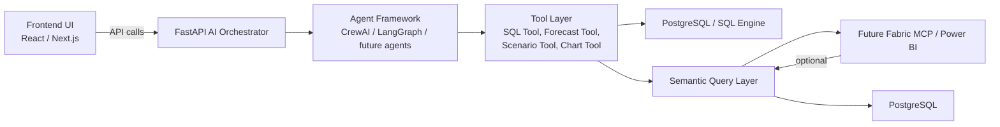

# AI-Native Conversational Analytics Platform Architecture

## High-Level Vision

This platform is designed to become an AI portfolio intelligence copilot that supports conversational analytics, dynamic charting, scenario simulation, and semantic query routing. The architecture centers around a FastAPI AI orchestrator with a provider-agnostic agent and tool layer, and it is built to be MCP-ready for future Microsoft Fabric / Power BI semantic integration.

## High-Level Architecture



## Folder Structure

```
backend/
  app/
    main.py
    config.py
    db.py
    routers/
      chat.py
    schemas/
      chat.py
      report_schema.py
    services/
      chat_service.py
      conversation_service.py
      intent_router.py
      query_router.py
      tool_registry.py
      semantic_query_service.py
      mcp_service.py
      llm_adapter.py
    tools/
      sql_tool.py
      forecast_tool.py
      scenario_tool.py
      chart_tool.py
      insights_tool.py
    models/
      base.py
      conversation.py
      message.py
      semantic_model.py
    utils/
      logger.py
      safety.py
      streaming.py

frontend/
  app/
    page.tsx
  components/
    ChatShell.tsx
    ChatInput.tsx
    MessageBubble.tsx
    ChartRenderer.tsx
    KPIDashboard.tsx
    ScenarioPanel.tsx
  services/
    api.ts
    chatApi.ts
    stream.ts
  types/
    chat.ts
    charts.ts
    kpi.ts
```

## API Contracts

### POST /api/chat

Request schema:
```json
{
  "session_id": "string",
  "user_id": "string",
  "message": "string",
  "conversation_id": "optional-string",
  "context": {"optional": "context"}
}
```

Response schema:
```json
{
  "session_id": "string",
  "conversation_id": "string",
  "messages": [
    {
      "id": "string",
      "role": "assistant",
      "content": "string",
      "created_at": "iso-datetime",
      "chart": {"chart_type": "line", "title": "Revenue"},
      "kpis": [{"label": "ARR", "value": 120000}]
    }
  ],
  "charts": [{"chart_type": "bar", "data": []}],
  "semantic_intent": "analyze_revenue",
  "tool_results": [{"tool": "sql_query_tool", "status": "ok"}]
}
```

### GET /api/conversations
- Returns saved conversations and summary metadata.

### GET /api/reports
- Returns generated insights and executive summaries.

## Provider-Agnostic AI Design

The backend is built using adapter layers:
- `LLMAdapter` abstracts OpenAI, Claude, Azure OpenAI, local models, and CrewAI
- `SemanticQueryService` abstracts PostgreSQL and future semantic/MCP execution
- `MCPService` provides a plug-in entry point for Microsoft Fabric semantic models

This preserves the existing PostgreSQL implementation while allowing seamless switching later.

## Conversational Flow

1. User sends a chat message to `/api/chat`
2. `IntentRouter` computes the request intent
3. `QueryRouter` creates a plan: which tools, semantic adapters, and context to use
4. `ToolRegistry` selects and executes tools
5. `LLMAdapter` composes the final assistant message using tool outputs
6. `ConversationService` persists session context and message history
7. Frontend renders answer, charts, KPI cards, and scenario results

## Future MCP Integration Plan

### How Fabric MCP connects later
- `MCPService` will connect to Fabric using token-authenticated endpoints
- The semantic layer will translate user intent into semantic model queries
- For KPI and metric exploration, the query engine will route to Fabric only when the question is semantic or requires unified data
- SQL remains the default execution for PostgreSQL mode

### Required components
- `semantic_models` metadata table
- `cached_queries` for query reuse
- `tool_execution_logs` for audit and governance
- `security_service` to enforce RBAC and tenant isolation

## Implementation Roadmap

### Phase 1: MVP (current sprint)
- Build `/api/chat` endpoint and chat UX
- Implement `LLMAdapter`, `IntentRouter`, `QueryRouter`, `ToolRegistry`
- Keep PostgreSQL as the source of truth
- Add conversation memory and session context
- Build dynamic chart rendering schema

### Phase 2: PoC
- Add scenario simulation tool and forecast agent
- Add semantic layer adapter with simple SQL query planner
- Store conversations, cached queries, and chart metadata
- Add provider-agnostic LLM configuration

### Phase 3: Production
- Add Microsoft Fabric MCP adapter in `MCPService`
- Add RBAC, audit logging, rate limiting
- Add multi-tenant and portfolio analytics support
- Add scheduled AI reports and alerting

## Security & Governance

- Authentication should be implemented using JWT / OAuth
- Requests must identify `user_id`, `session_id`, and `tenant_id`
- `SQLTool` should use a safe query builder and never run raw unvalidated SQL directly
- `MCPService` should enforce separate Fabric credentials per tenant
- Add `audit_logs` for every tool invocation and generated response

## Dynamic Visualization Schema

The platform returns charts in a structured format that the frontend renders dynamically.

Chart schema example:
```json
{
  "chart_type": "line",
  "title": "Revenue Trend",
  "x_axis": "record_date",
  "y_axis": ["metric_value"],
  "data": [{"record_date": "2024-01-01", "metric_value": 90000}],
  "dimensions": ["metric_name"],
  "aggregations": {"metric_value": "sum"}
}
```

## File-by-file Implementation Plan

- `backend/app/main.py`: register `chat` router, load config, keep DB startup logic
- `backend/app/routers/chat.py`: single chat entrypoint
- `backend/app/schemas/chat.py`: typed request/response and chart metadata
- `backend/app/services/chat_service.py`: orchestrates intent, planning, tools, and LLM
- `backend/app/services/semantic_query_service.py`: routes SQL/PostgreSQL or semantic/MCP queries
- `backend/app/services/mcp_service.py`: stub adapter for future Fabric connectors
- `backend/app/services/tool_registry.py`: maps intents to tool implementations
- `backend/app/tools/sql_tool.py`: safe SQL query execution tool
- `frontend/app/page.tsx`: new conversational copilot layout
- `frontend/components/ChatShell.tsx`: chat UI and message state
- `frontend/components/ChartRenderer.tsx`: dynamic chart rendering
- `frontend/services/chatApi.ts`: chat API integration
- `frontend/types/chat.ts`: shared chat schema types

## Example End-to-End Flow

User query:
`"What happened to NexusCorp revenue the last quarter and what if budget increases by 20%?"

Internal orchestration:
- `IntentRouter` classifies intent as `revenue_analysis + scenario_simulation`
- `QueryRouter` plans `SQLTool` to fetch revenue history + `ScenarioTool` to apply budget delta
- `LLMAdapter` generates an executive summary and chart description
- Response stream includes:
  - KPI card for revenue growth
  - line chart of historical revenue
  - simulated forecast chart for +20% budget
  - final summary text

Generated SQL example:
```sql
SELECT record_date, metric_value
FROM metrics_data m
JOIN companies c ON m.company_id = c.id
WHERE c.name ILIKE '%NexusCorp%'
  AND metric_name = 'revenue'
  AND record_date BETWEEN '2024-04-01' AND '2024-06-30'
ORDER BY record_date ASC
```

Generated response example:
```json
{
  "session_id": "session-123",
  "conversation_id": "conv-456",
  "messages": [{"role": "assistant", "content": "NexusCorp revenue grew 18%..."}],
  "charts": [{"chart_type": "line", "title": "Revenue Trend"}],
  "semantic_intent": "revenue_trend_analysis"
}
```
